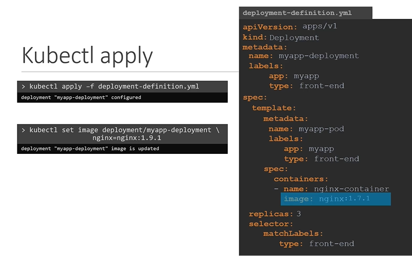
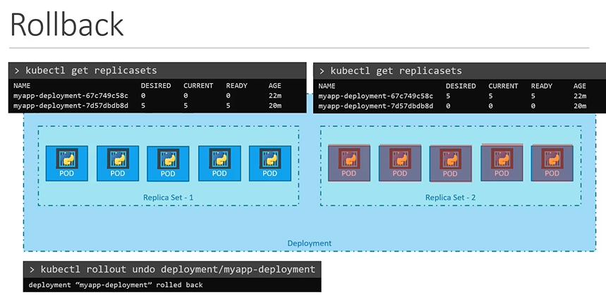

# Rolling Updates and Rollback
  - Take me to [Video Tutorial](https://kodekloud.com/courses/539883/lectures/9808204)
  
In this section, we will take a look at rolling updates and rollback in a deployment

## Rollout and Versioning in a Deployment
- When you first create a deployment it first create a rollout. A new rollout creates a new deployment revision (eg. v1)
- In the future, when the application is upgraded meaning when the container version is upgraded to a new one a new rollout is trigged and a new deploymnent revision is created named v2.
- This helps us keep track of the changes made to our deployment and enables us to rollback to a previous version of deployment if necessary.

  
  
## Rollout commands
- You can see the status of the rollout by the below command
  ```
  $ kubectl rollout status deployment/myapp-deployment
  ```
- To see the history and revisions
  ```
  $ kubectl rollout history deployment/myapp-deployment
  ```
 
  
  
## Deployment Strategies
- There are 2 types of deployment strategies
  1. Recreate
  2. RollingUpdate (Default Strategy)
  
  
  
## kubectl apply
- To update a deployment, edit the deployment and make necessary changes and save it. Then run the below command.
  ```
  apiVersion: apps/v1
  kind: Deployment
  metadata:
   name: myapp-deployment
   labels:
    app: nginx
  spec:
   template:
     metadata:
       name: myap-pod
       labels:
         app: myapp
         type: front-end
     spec:
      containers:
      - name: nginx-container
        image: nginx:1.7.1
   replicas: 3
   selector:
    matchLabels:
      type: front-end       
  ```
  ```
  $ kubectl apply -f deployment-defination.yaml
  ```
- Alternate way to update a deployment say for example for updating an image.
  ```
  $ kubectl set image deplyoment/myapp-deployment nginx=nginx:1.9.1
  ```
  
  
## Recreate vs RollingUpdate
  
  
  
## Upgrades

  
  
## Rollback
  
  
  
- To undo a change
  ```
  $ kubectl rollout undo deployment/myapp-deployment
  ```
  
## kubectl create
- To create a deplyoment
  ```
  $ kubectl create deployment nginx --image=nginx
  ```
## Summarize kubectl commands
```
$ kubectl create -f deployment-defination.yaml
$ kubectl get deployments
$ kubectl apply -f deployment-defination.yaml
$ kubectl set image deployment/myapp-deployment nginx=nginx:1.9.1
$ kubectl rollout status deployment/myapp-deployment
$ kubectl rollout history deployment/myapp-deployment
$ kubectl rollout undo deployment/myapp-deployment
```


 
#### K8s Reference Docs
- https://kubernetes.io/docs/concepts/workloads/controllers/deployment
- https://kubernetes.io/docs/tasks/run-application/run-stateless-application-deployment
