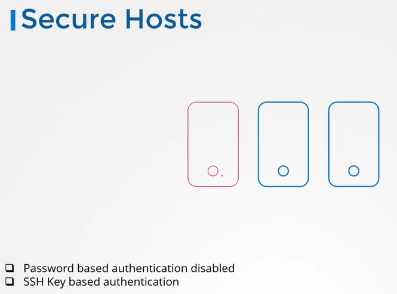
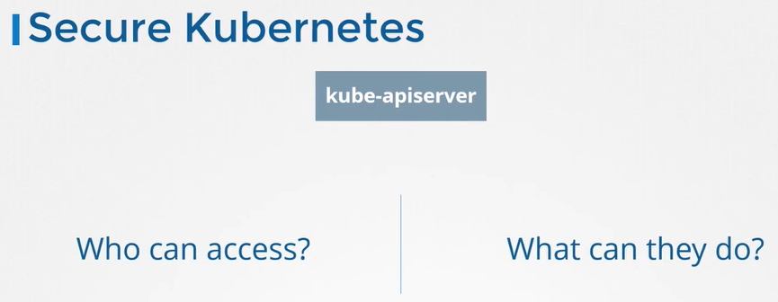
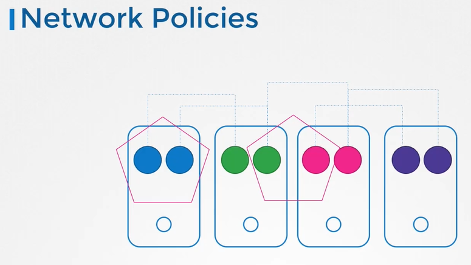

# Kubernetes Security Primitives
  - Take me to [Video Tutorial](https://kodekloud.com/courses/539883/lectures/9808248)
  
In this section, we will take a look at kubernetes security primitives

## Secure Hosts
- Of course all access to these hosts must be secured, root access disabled, password based authentication disabled and only ssh key based authentication to be made available.
- And any other measures you need to take to secure your physical or virtual infrastructure that hosts kubernetes.
  
  
  
## Secure Kubernetes
- Controlling access to the kube-apiserver.
- We need to make two types of decisions.
  - Who can access?
  - What can they do?
 
  
  
## Authentication
- Who can access the API Server is defined by the Authentication mechanisms.
- There are different ways that you can authenticate to the API Server.
  - User IDs and Passwords in static files
  - Username and Tokens 
  - Certificates
  - Integration with External Authentication providers like LDAP.
  - Finally, for machines we create service accounts
  
## Authorization
- Once they gain access to the cluster, what they can do is defined by authorization mechanisms.
- Authorization is implemented using Role Based Access Control (RBAC).
- In addition, there are other authorization modules like Attribute based access control (ABAC), Node Authorizers, webhook etc.

## TLS Certificates
- All communication with the cluster, between the various components such as the ETCD Cluster, kube-controller-manager, scheduler, api server, as well as those running on the working nodes such as the kubelet and kubeproxy is secured using TLS encryption.

 
 
## Network Policies
What about communication between applications within the cluster?
- By default all PODS can access all other PODs within the cluster.
- You can restrict access between then using Network Policies.

  
  
